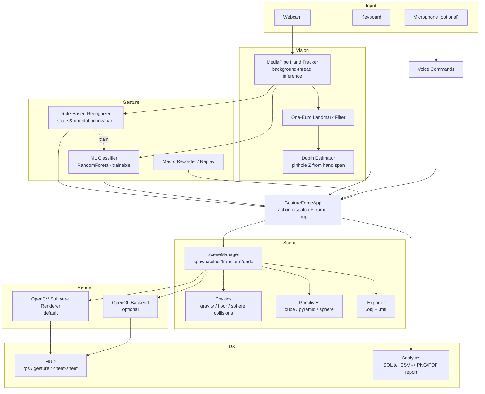

# GestureForge

> **Real-time, gesture-controlled 3D scene editor — driven entirely from a webcam, no browser required.**

Turn your webcam into a touchless 3D modelling studio. Hold a **pinch** to grab
and drag objects, open your **palm** to release, spread **two hands** to scale,
**twist** to rotate, flash a **peace sign** to switch primitives, and hold a
**thumbs-up** to export an end-of-session PDF report. Everything you can do with
your hands you can also do with your keyboard, so GestureForge demos reliably on
any machine.

It is the full evolution of the original single-file AR webcam prototype into a
clean, layered, maintainable application — with a proper scene graph, a software
3D renderer (plus optional OpenGL), a rule-based *and* trainable gesture engine,
physics, macros, voice commands, and analytics.

---

## ✨ Highlights

- 🖐️ **Multi-hand tracking** with MediaPipe (21-landmark hand geometry) and
  One-Euro filtered smoothing for rock-steady interaction.
- 🧊 **True 3D**, rendered with a model→view→perspective projection pipeline
  (Lambert shading + depth-aware painter’s algorithm). Pure OpenCV by default,
  optional **OpenGL** backend with graceful degradation.
- 🤏 **Full §7 gesture vocabulary** — pinch, fist, open palm, two-hand scale,
  twist-rotate, point (air-draw), swipe undo/redo, thumbs-up report, ok-sign
  calibrate, peace cycle.
- 🧠 **Two gesture engines**: fast, scale/orientation-invariant *rule-based*
  detection (zero training), plus an optional *scikit-learn RandomForest* you can
  train live with `T`.
- 🧲 **Physics** — gravity, floor collision, and sphere collisions with caching.
- ↩️ **Undo / redo** for every transform, and **macro recording/replay**.
- 🎨 **Air-draw mode** (`D`) for freehand 3D strokes, and **.obj + .mtl export**
  that opens cleanly in Blender.
- 🗣️ **Offline voice commands** (Vosk) when enabled (`--voice`).
- 📊 **Analytics** — SQLite/CSV session log + a PNG heatmap / PDF report.
- ⌨️ **Keyboard fallback for every gesture** — demo-able with no webcam.
- 🐳 **Docker** + **GitHub Actions CI** (ruff + 109 unit tests on camera-free
  modules) + `--headless-log-only` smoke mode.

---

## 🗺️ Architecture



```
gestureforge/                # repository root
├── main.py                  # CLI entry point
├── config/default_config.yaml
├── src/
│   ├── app.py               # main loop + gesture/keyboard/voice dispatch
│   ├── vision/              # hand tracker, landmark filter, depth estimator
│   ├── gestures/            # rule-based, ml classifier, trainer, macro, vocab
│   ├── scene/               # scene manager, transform, primitives, physics, exporter
│   ├── render/              # base_renderer, cv_renderer, gl_renderer
│   ├── ui/                  # HUD
│   ├── voice/               # offline voice commands (Vosk)
│   ├── analytics/           # session logger, report generator
│   └── utils/               # config loader, logger
├── tests/                   # 109 unit tests (camera/display-free)
├── assets/
├── .github/workflows/ci.yml
├── Dockerfile
├── requirements.txt
└── pyproject.toml
```

---

## 🚀 Quickstart

```bash
# 1. Create an environment (Python 3.10+)
python -m venv .venv
# Windows:   .venv\Scripts\activate
# macOS/Lnx: source .venv/bin/activate

# 2. Install
pip install -r requirements.txt

# 3. Run with your webcam
python main.py
```

**Try the keyboard-only demo** (no webcam required):

```bash
# spawn some cubes with the Space bar, grab with G, rotate with [ / ],
# scale with + / -, undo/redo with Ctrl+Z / Ctrl+Y, quit with Q
python main.py            # and ignore the hand overlay if none is detected
```

### Optional extras

```bash
pip install -e ".[voice]"      # offline speech commands  (Vosk + PyAudio)
pip install -e ".[opengl]"     # GPU-rendered OpenGL backend
pip install -e ".[report]"     # PDF session reports      (matplotlib + fpdf2)
pip install -e ".[ml]"         # trainable RandomForest classifier
```

| Flag | Effect |
|------|--------|
| `--camera N` | Webcam index (default `0`) |
| `--renderer opencv\|opengl` | Rendering backend (default `opencv`) |
| `--voice` | Enable the optional voice command layer |
| `--resolution 1280x720` | Camera resolution as `WxH` |
| `--config path.yaml` | Override config defaults |
| `--no-ml` | Disable the trained ML gesture classifier |
| `--headless-log-only` | CI smoke test: init + log + exit, no display needed |

---

## ✋ Gesture Cheat-Sheet

| Gesture | Action | Keyboard fallback |
|---------|--------|-------------------|
| 🤏 **Pinch** | Grab/drag object under fingertip; if none, spawn one at the fingertip | `Space`, `G` |
| ✊ **Fist** | Grab selected / first object (hold to keep grabbed) | `G` |
| 🖐️ **Open palm** | Release the grabbed object | `G` |
| 🤲 **Two-hand pinch** | Widen/narrow hand span to scale the selected object | `+` / `-` |
| 🔄 **Twist** (two hands) | Relative hand-angle change rotates the selected object | `[` / `]` |
| 👆 **Point** (index) | Air-draw a 3D stroke (when in draw mode) | `D` toggle |
| ⬅️ **Swipe left** | Undo | `Ctrl+Z` |
| ➡️ **Swipe right** | Redo | `Ctrl+Y` |
| 👍 **Thumbs-up** (hold) | Export the end-of-session report | `S` |
| 👌 **OK sign** | Re-calibrate gesture thresholds | `C` |
| ✌️ **Peace** | Cycle cube → pyramid → sphere | `Tab` |

### Other keys

| Key | Action |
|-----|--------|
| `H` | Toggle the on-screen help / cheat-sheet |
| `F` | Toggle the vision debug overlay |
| `R` / `P` | Record / replay a macro |
| `X` | Clear the scene (undoable) |
| `T` | Toggle live gesture-training mode |
| `Q` / `Esc` | Quit |

---

## ⚙️ Configuration

All tunables live in `config/default_config.yaml` — camera index/resolution,
renderer choice, gesture thresholds, physics constants, HUD styling, voice, and
key bindings. A custom config is merged on top of the defaults:

```bash
python main.py --config my_setup.yaml
```

Keys are read with a dot-path `Config` accessor, and every CLI flag overrides the
corresponding config value at runtime.

---

## 🧪 Testing & CI

```bash
pip install -e ".[dev]"
python -m pytest tests/ -q     # 109 tests, all camera/display-free
python main.py --headless-log-only   # smoke: init + log session + exit 0
python -m ruff check src/ tests/ main.py
```

GitHub Actions runs **lint + tests + headless smoke** across Python 3.10–3.12 on
every push/PR. A `Dockerfile` is provided for containerized runs (the image is
ideal for the headless smoke test and test suite; live webcam passthrough is best
supported on Linux hosts).

---

## 🛣️ Roadmap

- [x] **v0.1** — full app layered out of the original 126-line `visual_exp.py`
  prototype: scene graph, software 3D renderer, rule-based gestures, physics,
  undo/redo, macros, analytics, voice, Docker, and CI.
- [ ] Webcam-free "remote" gesture input over UDP/IP for distributed demos.
- [ ] GLTF/GLB export alongside OBJ.
- [ ] Per-gesture confidence tuning UI in the HUD.
- [ ] Mobile / AR-HMD passthrough builds.

---

## 📄 License

MIT — add a `LICENSE` file before publishing if you intend to distribute.

*Built with OpenCV, MediaPipe, NumPy, and scikit-learn.*
